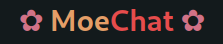

 

<b>simple chat app with golang and react.js</b>

### structure

| Folder      | Description |
| ----------- | ----------- |
| Futa        | Golang API  |
| Mashu       | Next JS     |

### teach stack
- **Back End**
  
  - Golang
  - Fiber
  - Postgre SQL
  - Websocket

- **Front End**

  - React Js
  - Next Js
  - Tailwind Css

- **Other**
  - docker
  - google cloud for the server
  - github action for ci/cd for the back end
  - vercel for deploy the front end
